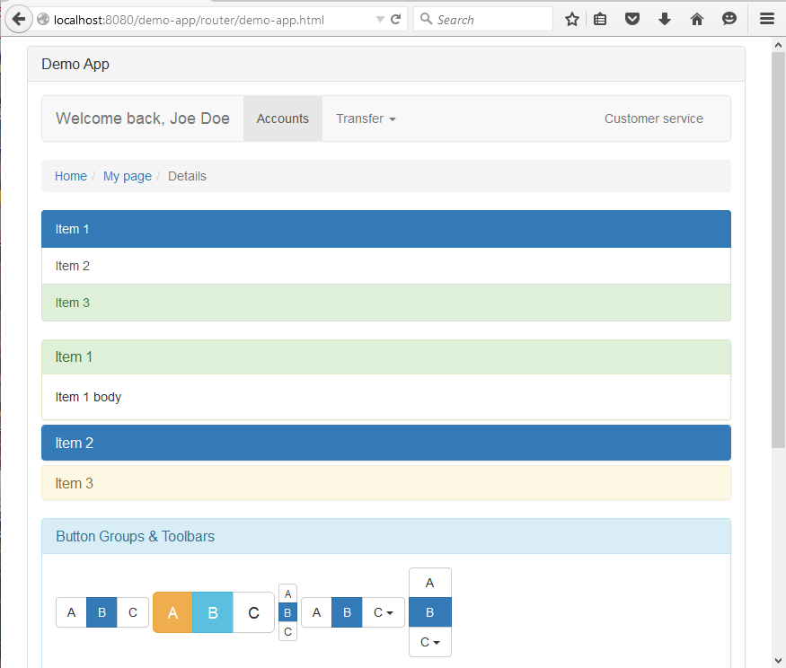
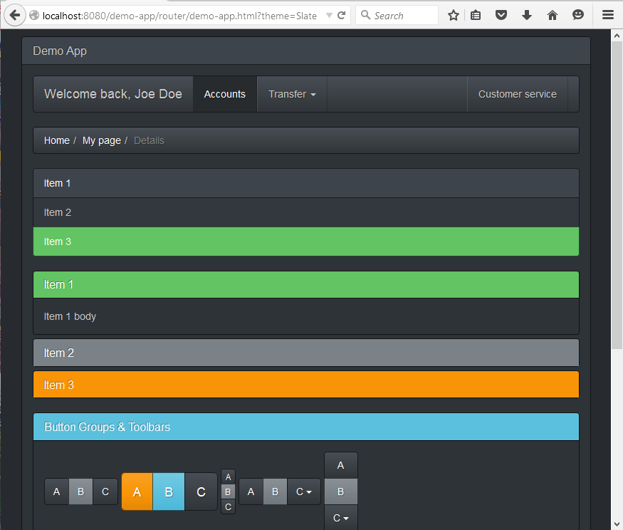

# HTML

[org.nasdanika.html](http://www.nasdanika.org/products/html/apidocs/org.nasdanika.html/apidocs/index.html) bundle provides [fluent API](https://en.wikipedia.org/wiki/Fluent_interface) for building HTML code including:

* HTML (low level), 
* [Bootstrap](http://getbootstrap.com/), 
* [Font Awesome](https://fortawesome.github.io/Font-Awesome/), 
* [AngularJS](https://angularjs.org/), 
* [Knockout](http://knockoutjs.com/index.html),
* Application - convenience methods and interfaces for constructing single page router applications with a header, navigation bar, content panels and footer.  

The goal of the bundle is to provide a Java developer a set of API's to build modern Web UI (Bootstrap, Font Awesome) and Single-Page Applications (AngularJS, KnockoutJS) without having to switch contexts (Java -> HTML, Bootstrap, ...) and without having to remember all the minutia of the underlying frameworks - API's, enumerations, and IDE code completion reduce mental load.   

The library uses [Factory](https://en.wikipedia.org/wiki/Factory_(object-oriented_programming))/[Builder](https://en.wikipedia.org/wiki/Builder_pattern) patterns, similar to [Java DOM XML API](https://docs.oracle.com/javase/tutorial/jaxp/dom/index.html):
* An instance of [HTMLFactory](http://www.nasdanika.org/products/html/apidocs/org.nasdanika.html/target/site/apidocs/org/nasdanika/html/HTMLFactory.html) is used to create instances of API interfaces.
* Instances created by the factory act as builders. 
* HTML markup is produced by invoking ``toString()`` or ``produce()`` methods of API interfaces.

Example:

```java
String scriptTag = htmlFactory.tag(TagName.script, getClass().getResource("Script.js")).toString();
```

In applications where HTML API is used out of the context of a web request [DefaultHTMLFactory](http://www.nasdanika.org/products/html/apidocs/org.nasdanika.html/target/site/apidocs/org/nasdanika/html/impl/DefaultHTMLFactory.html) class can be directly instantiated and used as HTMLFactory implementation. In a context of a web request, e.g. in routes or route operations, and instance of HTMLFactory can be obtained either by adapting [HttpServletRequestContext](http://www.nasdanika.org/server/apidocs/org.nasdanika.web/target/site/apidocs/org/nasdanika/web/HttpServletRequestContext.html) or by specifying a context parameter - in this case the framework will adapt the context to HTMLFactory.

Many HTML interfaces extend [Producer](http://www.nasdanika.org/products/html/apidocs/org.nasdanika.html/target/site/apidocs/org/nasdanika/html/Producer.html) and [AutoCloseable](http://docs.oracle.com/javase/8/docs/api/java/lang/AutoCloseable.html). Many API methods take objects as arguments to build a composite HTML object from parts.

The simplest way to produce HTML from an object created by HTMLFactory is to invoke its ``toString()`` method. In classes which implement ``Producer`` ``toString()`` invokes ``produce()`` and then stringifies its return value:

```java
public String toString() {
	return stringify(produce(0), 0);
}
```

Objects are converted to HTML string (stringified) using the following algorithm (see. [UIElementImpl.toHTML()](http://www.nasdanika.org/products/html/apidocs/org.nasdanika.html/target/site/apidocs/src-html/org/nasdanika/html/impl/UIElementImpl.html#line.1063) source code):  

* If object is ``null`` then it is treated as a blank string.
* If object is [String](http://docs.oracle.com/javase/8/docs/api/java/lang/String.html), then it is used as-is. 
* If object implements Producer, then its ``produce()`` method is invoked and return value is recursively passed to stringification. 
* If object implements [FactoryProducer](http://www.nasdanika.org/products/html/apidocs/org.nasdanika.html/target/site/apidocs/org/nasdanika/html/FactoryProducer.html), then its ``produce(HTMLFactory)`` method is invoked and return value is recursively passed to stringification. 
* If ``Producer.Adapter`` was set in the factory with ``setProducerAdapter()`` method, then the adapter is used to adapt object to producer. If adapter returns non-null value then it is passed to stringification.
* If ``FactoryProducer.Adapter`` was set in the factory with ``setFactoryProducerAdapter()`` method, then the adapter is used to adapt object to factory producer. If the adapter returns non-null value then it is passed to stringification.
* If object is [InputStream](http://docs.oracle.com/javase/8/docs/api/java/io/InputStream.html) or [Reader](http://docs.oracle.com/javase/8/docs/api/java/io/Reader.html), its content is converted to string.
* If object is [URL](http://docs.oracle.com/javase/8/docs/api/java/net/URL.html), then its input stream is used to retrieve text content.
* Otherwise object's ``toString()`` method is invoked.

Example - loading script from a classloader resource:

```java
htmlFactory.tag(TagName.script, getClass().getResource("Script.js"));
```

When ``close()`` method is invoked on HTML object, the object invokes ``close`` on all its parts. It allows to build complex HTML composites from parts which hold system resources such as OSGi services or database connections and release the resources by invoking ``close`` on the top object.

``Producer`` and ``FactoryProducer`` are functional interfaces. It allows to assemble HTML objects from lambdas and method references.

## Low level API
Low level HTML API provide means to construct HTML elements and manipulate their content and attributes. Higher level API implementations are built leveraging low-level API. The base interface for most HTML element interfaces is [UIElement](http://www.nasdanika.org/products/html/apidocs/org.nasdanika.html/target/site/apidocs/org/nasdanika/html/UIElement.html). HTML [Tag](http://www.nasdanika.org/products/html/apidocs/org.nasdanika.html/target/site/apidocs/org/nasdanika/html/Tag.html) can be created using ``tag(String, Object...)`` and ``tag(TagName, Object...)`` methods of HTMLFactory, where [TagName](http://www.nasdanika.org/products/html/apidocs/org.nasdanika.html/target/site/apidocs/org/nasdanika/html/Tag.TagName.html) is an enumeration of tag names. 

``div(Object...)`` and ``span(Object...)`` are convenience methods - they invoke ``tag()`` behind the scenes.

``nextId()`` method can be used to generate element ID's.

``input(InputType)`` method can be used to create [input](http://www.nasdanika.org/products/html/apidocs/org.nasdanika.html/target/site/apidocs/org/nasdanika/html/Input.html) elements. [InputType](http://www.nasdanika.org/products/html/apidocs/org.nasdanika.html/target/site/apidocs/org/nasdanika/html/HTMLFactory.InputType.html) is an enumeration of input types. [TextArea](http://www.nasdanika.org/products/html/apidocs/org.nasdanika.html/target/site/apidocs/org/nasdanika/html/TextArea.html) and [Select](http://www.nasdanika.org/products/html/apidocs/org.nasdanika.html/target/site/apidocs/org/nasdanika/html/Select.html) are created by ``textArea()`` and ``select()`` methods respectively.

``fragment(Object...)`` method creates a [Fragment](http://www.nasdanika.org/products/html/apidocs/org.nasdanika.html/target/site/apidocs/org/nasdanika/html/Fragment.html), which is a collection of HTML elements which can be operated on as single unit.

Some other low-level factory methods include ``link(Object, Object...)``, ``ol(Iterable<?>)``, and ``ul(Iterable<?>)``.

## CSS Styles

CSS styles can be set with ``style(String,Object)`` method or with UIElement ``style()`` method which returns [Style](http://www.nasdanika.org/products/html/apidocs/org.nasdanika.html/target/site/apidocs/org/nasdanika/html/Style.html) interface providing bindings for frequently used styles, e.g.

```java
Tag tag = htmlFactory.div(content).style().text().size("150%");
```

## Bootstrap
The HTML bundle API provides interfaces and methods for the majority of [Bootstrap](http://getbootstrap.com/) elements. The API attempts to follow Bootstrap documentation as close as possible - interface and method names shall be self-descriptive after getting familiar with Bootstrap.

Bootstrap classes can be set on any UIElement by invoking ``bootstrap()`` method and then one of [Bootstrap](http://www.nasdanika.org/products/html/apidocs/org.nasdanika.html/target/site/apidocs/org/nasdanika/html/Boostrap.html) interface methods, e.g.:

```java
Tag tag = htmlFactory.div(content).bootstrap().grid().container();
```

### Forms
Bootstrap forms functionality is available through [Form](http://www.nasdanika.org/products/html/apidocs/org.nasdanika.html/target/site/apidocs/org/nasdanika/html/Form.html) interface. Inputs shall be created by 
HTMLFactory and then added to [FormGroup](http://www.nasdanika.org/products/html/apidocs/org.nasdanika.html/target/site/apidocs/org/nasdanika/html/FormGroup.html), [FormInputGroup](http://www.nasdanika.org/products/html/apidocs/org.nasdanika.html/target/site/apidocs/org/nasdanika/html/FormInputGroup.html) or [InputGroup](http://www.nasdanika.org/products/html/apidocs/org.nasdanika.html/target/site/apidocs/org/nasdanika/html/InputGroup.html) by invoking respective Form methods.

### Glyphicons
[Glyphicons](http://www.nasdanika.org/products/html/apidocs/org.nasdanika.html/target/site/apidocs/org/nasdanika/html/Bootstrap.Glyphicon.html) enumeration contains a list of [Bootstrap glyphs](http://getbootstrap.com/components/#glyphicons) and ``glyphicon(Glyphicon)`` method can be used to create a glyph:

```java
Tag searchGlyph = htmlFactory.glyphicon(Glyphicon.search);
```

### Misc
``stackModal()`` generates JavaScript which allows to stack Bootstrap modals.

## Font Awesome
[Font Awesome](https://fortawesome.github.io/Font-Awesome/) glyphs can be added to any UIElement by invoking ``fontAwesome()`` method, and then one of category methods, e.g.:

```
mySpan.fontAwesome().webApplication(WebApplication.desktop)
```

``fontAwesome()`` factory method is a shortcut for ``span().fontAwesome()``. [FontAwesome.Stack](http://www.nasdanika.org/products/html/apidocs/org.nasdanika.html/target/site/apidocs/org/nasdanika/html/FontAwesome.Stack.html) interface is used for creating [stacked icons](https://fortawesome.github.io/Font-Awesome/examples/#stacked), it can be created with the factory method ``fontAwesomeStack()``.

## AngularJS
[AngularJS](https://angularjs.org/) directives can be added to UIElement's by invoking ``angular()`` method and then one of methods of returned [Angular](http://www.nasdanika.org/products/html/apidocs/org.nasdanika.html/target/site/apidocs/org/nasdanika/html/Angular.html) instance:

```java
myButton.angular().click("doCoolStuff()")
```

## Knockout
Similarly to AngularJS directives, [Knockout](http://knockoutjs.com/index.html) bindings can be added to UIElement's by invoking ``knockout()`` methods and then of of methods of returned [Knockout](http://www.nasdanika.org/products/html/apidocs/org.nasdanika.html/target/site/apidocs/org/nasdanika/html/Knockout.html) instance:

```java
myButton.knockout().click("doCoolStuff()")
```

[Knockout virtual elements](http://www.nasdanika.org/products/html/apidocs/org.nasdanika.html/target/site/apidocs/org/nasdanika/html/KnockoutVirtualElement.html) can be created with the factory's ``knockoutVirtualElement(Object... content)`` method.

## Templates and interpolation
HTMLFactory supports simple templating two [interpolate](http://www.nasdanika.org/products/html/apidocs/org.nasdanika.html/target/site/apidocs/org/nasdanika/html/HTMLFactory.html#interpolate-java.lang.Object-org.nasdanika.html.HTMLFactory.TokenSource-) methods which expand ``{{token name}}`` tokens in the source. Source is stringified before expansion using the algorithm explained above.

If simple interpolation is not enough, you can use [JET](https://eclipse.org/modeling/m2t/?project=jet) templates, [Mustache for Java](https://github.com/spullara/mustache.java) or any other template engine you like.

### Example

The code below reads ``Module.js`` resource, replaces ``{{dependencies}}`` token with its value, and creates a script tag.

```java
Tag script = htmlFactory.tag(TagName.script, htmlFactory.interpolate(getClass().getResource("MyModule.js", Collections.singletonMap("dependencies", "..."))));
```


## Application

``applicationPanel()`` factory methods creates an instance of [ApplicationPanel](http://www.nasdanika.org/products/html/apidocs/org.nasdanika.html/target/site/apidocs/org/nasdanika/html/ApplicationPanel.html), which provides a convenient way to create web pages with a header, navigation bar, several content panels and a footer.

``routerApplication()`` factory method generates a single-page application with a [Backbone route](http://backbonejs.org/#Router) which loads server-side content using AJAX to an HTML element with ``id`` specified in the route path. In this page's URL from the information center ``http://localhost:8080/information-center/router/doc.html#router/doc-content//information-center/router/doc/bundle/org.nasdanika.web/doc/html.md``:

 * ``http://localhost:8080/information-center/router/doc.html`` - Documentation application route URL.
 * ``router`` - router path.
 * ``doc-content`` - ID of the HTML element where to load content.
 * ``/information-center/router/doc/bundle/org.nasdanika.web/doc/html.md`` - URL of the page to load. 
 
 Notice the double-slash in the URL fragment - it is used because the full path to page URL is provided. With a single slash it'd be treated as relative. The same URL can be written as ``http://localhost:8080/information-center/router/doc.html#router/doc-content/doc/bundle/org.nasdanika.web/doc/html.md`` with documentation page path relative to the documentation application route path - ``doc/bundle/org.nasdanika.web/doc/html.md``.  

Stylesheets and scripts used by the application can be set at the HTMLFactory level or specified by the client code. In Nasdanika Foundation Server applications application-wide scripts and stylesheets are configured through extensions in ``plugin.xml`` of the application bundle.

``bootstrapRouterApplication()`` method is similar to ``routerApplicationMethod()`` but allows to specify a UI [Theme](http://www.nasdanika.org/products/html/apidocs/org.nasdanika.html/target/site/apidocs/org/nasdanika/html/Theme). [Nasdanika Application Workspace Wizard](Home) generates applications with the default Bootstrap theme and themes from [Bootswatch](https://bootswatch.com/).

## Sample code
The code below was generated by a wizard:
```java
package org.nasdanika.demo.app;

import org.nasdanika.html.Accordion;
import org.nasdanika.html.ApplicationPanel;
import org.nasdanika.html.Breadcrumbs;
import org.nasdanika.html.Fragment;
import org.nasdanika.html.HTMLFactory;
import org.nasdanika.html.HTMLFactory.Glyphicon;
import org.nasdanika.html.Navbar;
import org.nasdanika.html.Theme;
import org.nasdanika.html.UIElement.DeviceSize;
import org.nasdanika.html.UIElement.Event;
import org.nasdanika.html.UIElement.Size;
import org.nasdanika.html.UIElement.Style;
import org.nasdanika.web.HttpServletRequestContext;
import org.nasdanika.web.Action;
import org.nasdanika.web.Route;
import java.util.Date;

/**
 * Route to demonstrate/test HTMLFactory capabilities
 *
 */
public class DemoAppRoute implements Route {

	@Override
	public Action execute(HttpServletRequestContext context, Object... args) throws Exception {
		final HTMLFactory htmlFactory = context.adapt(HTMLFactory.class);
		
		ApplicationPanel appPanel = htmlFactory.applicationPanel()
				.header("Demo App")
				.headerLink("#")
				.footer(
						htmlFactory.link("#", "Contact us"), 
						"&nbsp;&middot;&nbsp;", 
						htmlFactory.link("#", "Privacy Policy"))
				.width(800);
		
		Navbar navBar = htmlFactory.navbar("Welcome back, Joe Doe", "#")
				.item(htmlFactory.link("#", "Accounts"), true, false)
				.item(htmlFactory.link("#", "Customer service"), false, true);
						
		navBar.dropdown("Transfer", false)
				.item(htmlFactory.link("#", "Internal"))
				.divider()
				.header("External transfers")
				.item(htmlFactory.link("#", "Wire"))
				.item(htmlFactory.link("#", "Payment Gateway"));
		
		Breadcrumbs breadcrumbs = htmlFactory.breadcrumbs()
				.item("#", "Home")
				.item("#", "My page")
				.item(null, "Details");
		
		appPanel.navigation(navBar, breadcrumbs);
		
		appPanel.contentPanel(
				htmlFactory.linkGroup()
					.item("Item 1", "#", Style.DEFAULT, true)
					.item("Item 2", "#", Style.DEFAULT, false)
					.item("Item 3", "#", Style.SUCCESS, false))
				.width(DeviceSize.LARGE, 2).id("side-panel");
				
		Accordion accordion = htmlFactory.accordion()
				.item("Item 1", "Item 1 body")
				.item("Item 2", Style.PRIMARY, "Item 2 body")
				.item("Item 3", Style.WARNING, "Item 3 body")
				.style(Style.SUCCESS);
		
		Fragment body = htmlFactory.fragment(accordion);
		
		// Button groups 
		Fragment buttonGroups = htmlFactory.fragment();
		buttonGroups.content(
				htmlFactory.buttonGroup(
						htmlFactory.button("A").on(Event.click, "alert('Here we go!!!');"),
						htmlFactory.button("B").style(Style.PRIMARY),
						htmlFactory.button("C")),
				"&nbsp;",
				htmlFactory.buttonGroup(
						htmlFactory.button("A").style(Style.WARNING),
						htmlFactory.button("B").style(Style.INFO),
						htmlFactory.button("C")).size(Size.LARGE),
				"&nbsp;",
				htmlFactory.buttonGroup(
						htmlFactory.button("A"),
						htmlFactory.button("B").style(Style.PRIMARY),
						htmlFactory.button("C")).vertical().size(Size.EXTRA_SMALL),
				"&nbsp;",
				htmlFactory.buttonGroup(
						htmlFactory.button("A"),
						htmlFactory.button("B").style(Style.PRIMARY),
						htmlFactory.button("C")
							.item(htmlFactory.link("#", "C1"))
							.divider()
							.header("C2")
							.item(htmlFactory.link("#", "C2.1"))
							.item(htmlFactory.link("#", "C2.2"))),
				"&nbsp;",
				htmlFactory.buttonGroup(
						htmlFactory.button("A"),
						htmlFactory.button("B").style(Style.PRIMARY),
						htmlFactory.button("C")
							.item(htmlFactory.link("#", "C1"))
							.divider()
							.header("C2")
							.item(htmlFactory.link("#", "C2.1"))
							.item(htmlFactory.link("#", "C2.2"))).vertical(),
				"<HR/>", 
				htmlFactory.label(Style.SUCCESS, "This is a button toolbar ", htmlFactory.glyphicon(Glyphicon.arrow_down)),
				"<P/>",
				htmlFactory.buttonToolbar(
						htmlFactory.buttonGroup(
								htmlFactory.button("A"),
								htmlFactory.button("B").style(Style.PRIMARY),
								htmlFactory.button("C")),
						htmlFactory.buttonGroup(
								htmlFactory.button("X"),
								htmlFactory.button("Y").style(Style.PRIMARY),
								htmlFactory.button("Z")
								.item(htmlFactory.link("#", "Z1"))
								.divider()
								.header("Z2")
								.item(htmlFactory.link("#", "Z2.1"))
								.item(htmlFactory.link("#", "Z2.2")))
						),
				"<HR/>", 
				htmlFactory.buttonGroup(
						htmlFactory.button("A"),
						htmlFactory.button("B").style(Style.PRIMARY),
						htmlFactory.button("C")
							.item(htmlFactory.link("#", "C1"))
							.divider()
							.header("C2")
							.item(htmlFactory.link("#", "C2.1"))
							.item(htmlFactory.link("#", "C2.2"))).justified()				
				);
		
		
		body.content(htmlFactory.panel(Style.INFO, "Button Groups &amp; Toolbars", buttonGroups, null).id("button-groups"));
		
		appPanel.contentPanel(body).width(DeviceSize.LARGE, 10);
		
		body.content(
				htmlFactory.panel(
						Style.INFO, 
						null,
						new AutoCloseable() {
							
							@Override
							public String toString() {
								// Produce dynamic HTML
								return htmlFactory
										.label(Style.SUCCESS, new Date())
										.toString();
							}
							
							@Override
							public void close() throws Exception {
								// Close resources;								
							}
						}, 						 
						null));
		
		String themeName = context.getRequest().getParameter("theme");
		
		final AutoCloseable app = 
			htmlFactory.bootstrapRouterApplication(
				themeName == null ? null : Theme.valueOf(themeName), 
				"My Application", 
				null, 
				null, 
				appPanel);
		
		// TODO Auto-generated method stub
		return new Action() {
			
			@Override
			public void close() throws Exception {
				app.close();				
			}
			
			@Override
			public Object execute() throws Exception {
				return app.toString();
			}
		};
	}

	@Override
	public boolean canExecute() {
		return true;
	}

	@Override
	public void close() throws Exception {
		// NOP
	}

}
``` 

### Screenshots

#### Default theme



#### Slate theme



## Code formatting

The library formats output code. If, for some reason, formatting performed by the library is not sufficient, an HTML parser like [jsoup](http://jsoup.org/) can be used for output formatting.

## Dependencies
The library depends on [Apache Commons Lang 3](https://commons.apache.org/proper/commons-lang/). In OSGi environment this dependency is taken care of by the framework.

## Sample application
[Task Manager](https://github.com/Nasdanika/task-manager) is a simple single-page application which demonstrates how to use the library,  Bootstrap and AngularJS API's in particular. The initial list of tasks in the application contains steps to get started with the HTML library.


## API Documentation

* http://www.nasdanika.org/products/html/apidocs/org.nasdanika.html/apidocs/)

## P2 Repository

* ``http://www.nasdanika.org/products/html/repository``
* [Archived](http://www.nasdanika.org/products/html/org.nasdanika.html.repository-0.1.0-SNAPSHOT.zip)

## Examples

* [Task Manager](https://github.com/Nasdanika/task-manager)
 
## Roadmap

* Update API's to match latests versions of Bootstrap and Knockout.
* Mark more html tags as paired in the HTML tags enumeration.

## How to contribute

As an open source project we use the [Fork and Pull Model](https://help.github.com/articles/about-collaborative-development-models/).
You can find more information about collaborative development at GitHub in this article - [Collaborating with issues and pull requests](https://help.github.com/categories/collaborating-with-issues-and-pull-requests).

When you contribute code, please make sure that the changes are clearly identifiable. In particular, avoid making non-functional changes in the code which you do not touch, 
e.g. auto-formatting of an entire compilation unit. 

